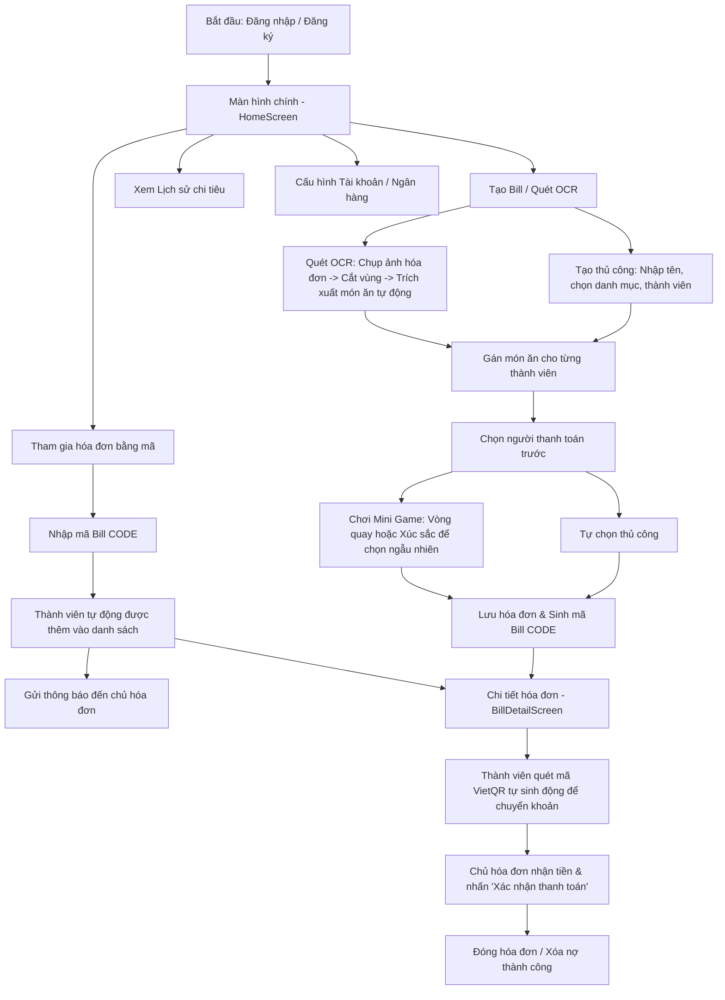

# 📑 Dự án Share Bill - Ứng Dụng Quản Lý Và Chia Hóa Đơn Nhóm

Dự án **Share Bill** là ứng dụng di động được xây dựng bằng **React Native (Expo)** kết hợp với giả lập **JSON Server** phía Backend. Ứng dụng hỗ trợ các nhóm bạn bè, đồng nghiệp dễ dàng ghi chép chi tiêu, tự động chia hóa đơn theo từng món ăn/dịch vụ (Itemized Split), tích hợp quét hóa đơn bằng công nghệ OCR, tạo mã thanh toán VietQR động và tổ chức Mini Games vui vẻ để tìm người trả tiền.

---

## 🚀 Các Chức Năng Chính (Core Features)

### 1. Xác thực & Quản lý Tài khoản (Authentication & Profile)
*   **Đăng ký & Đăng nhập:** Cho phép người dùng đăng ký tài khoản qua Số điện thoại, Email, Họ tên và thông tin ngân hàng.
*   **Quên mật khẩu:** Khôi phục mật khẩu thông qua kiểm tra Số điện thoại/Email và câu trả lời bảo mật.
*   **Cấu hình Ngân hàng:** Người dùng cập nhật Ngân hàng (danh sách lấy trực tiếp từ API VietQR) và Số tài khoản ngân hàng cá nhân để người khác chuyển khoản.
*   **Mã QR tài khoản:** Hiển thị mã QR định danh cá nhân phục vụ kết bạn/tìm kiếm nhanh.
*   **Hệ thống Thông báo:** Nhận thông báo thời gian thực khi có người dùng mới tham gia hóa đơn của mình bằng mã.

### 2. Quản lý Hóa đơn & Chia tiền (Bill Management & Smart Split)
*   **Tạo mới/Chỉnh sửa/Xóa hóa đơn:** Tạo hóa đơn với thông tin tiêu đề, ngày tháng, danh mục (Ăn uống, Du lịch, Mua sắm, Giải trí) và thành viên tham gia hóa đơn.
*   **Chia hóa đơn chi tiết (Itemized Split):** Hỗ trợ thêm từng món (Tên món, Giá tiền, Số lượng) và chọn chính xác những ai cùng ăn món đó để chia tiền công bằng nhất.
*   **Quét hóa đơn bằng OCR:** Tích hợp camera/thư viện ảnh, cho phép cắt vùng hóa đơn (Crop Image) và gửi qua API của OCR.space để tự động nhận dạng chữ tiếng Việt, tự động điền danh sách món và giá tiền vào form tạo hóa đơn.

### 3. Mini Games Chọn Người Thanh Toán (Minigames)
Tích hợp trực tiếp vào luồng tạo hóa đơn để giải quyết vấn đề "ai sẽ là người đứng ra trả tiền trước" một cách vui vẻ:
*   **Vòng quay may mắn (Lucky Wheel):** Quay vòng xoay chứa danh sách thành viên trong nhóm để chọn ra một người ngẫu nhiên.
*   **Đổ xúc sắc (Dice Roll):** Mỗi thành viên sẽ được lắc một xúc sắc ngẫu nhiên từ 1 đến 6 điểm. Thành viên có số điểm thấp nhất sẽ được chọn.
*   **Tích hợp âm thanh sinh động:** Sử dụng nhạc nền (file `vip.mp3` nội bộ) và hiệu ứng âm thanh (quay vòng, xúc sắc, tiếng chiến thắng) tạo cảm giác kịch tính.
*   **Liên kết tự động:** Kết quả trò chơi sẽ được tự động gán làm người thanh toán (`paidBy`) khi quay trở lại màn hình tạo hóa đơn.

### 4. Quyết toán & Quyên góp nợ (Settlement & Tracking)
*   **Thống kê tài chính:** Tại màn hình trang chủ, hiển thị tổng quan số tiền mình nợ người khác (Cần trả) và số tiền người khác nợ mình (Cần thu).
*   **Mã VietQR động:** Ở trang chi tiết hóa đơn, thành viên nợ tiền chỉ cần nhấn "Xem mã QR chuyển khoản" để sinh mã QR động tự động điền sẵn Ngân hàng, Số tài khoản của người trả hộ, Số tiền cần thanh toán và Cú pháp chuyển khoản chuẩn (`CHIA BILL <TEN_BILL>`).
*   **Xác nhận thanh toán:** Người trả hộ (Chủ hóa đơn) có quyền nhấn nút "Xác nhận" để đánh dấu một thành viên đã chuyển khoản thành công, hệ thống sẽ xóa nợ của người đó và đưa trạng thái về "Đã thanh toán".
*   **Tham gia hóa đơn bằng mã:** Hóa đơn sau khi lưu sẽ sinh ra một mã duy nhất (ví dụ: `BILL-GOGI`). Thành viên khác chỉ cần nhập mã này tại trang chủ là có thể tự động tham gia vào hóa đơn.

---

## 🔄 Các Luồng Nghiệp Vụ Chính (Main User Flows)

### Luồng chi tiết:

1.  **Luồng Đăng ký & Cài đặt Tài khoản:**
    *   Người dùng đăng ký số điện thoại và đặt mật khẩu.
    *   Sau khi đăng nhập thành công, người dùng truy cập màn hình **Profile** để thiết lập tài khoản ngân hàng (tên ngân hàng được chọn từ danh mục lấy qua API VietQR) và thiết lập câu hỏi bảo mật để phòng trường hợp khôi phục tài khoản.
2.  **Luồng Tạo Hóa Đơn & Chia Món (Itemized Bill Split):**
    *   Tại màn hình chính, người dùng chọn **Tạo Bill Mới** hoặc **Quét Bill** (OCR).
    *   Nếu chọn **Quét Bill**, người dùng chụp hình hóa đơn, thực hiện kéo thả khung cắt ảnh (Crop) để lấy danh sách món ăn. Hệ thống gửi ảnh Base64 lên OCR.space API, nhận kết quả văn bản tiếng Việt và tách ra các dòng tương ứng với tên món ăn và giá để đưa trực tiếp vào form.
    *   Người tạo hóa đơn tiến hành thêm các thành viên tham gia bằng cách tìm kiếm username của họ.
    *   Người tạo gán cụ thể từng món ăn cho các thành viên tương ứng ăn món đó. Số tiền mỗi món được chia đều cho những người cùng chia sẻ món ăn đó.
    *   Người tạo chọn ai là người trả trước tiền cho toàn bộ hóa đơn. Nếu phân vân, họ nhấn vào biểu tượng game xúc sắc để mở màn hình **Mini Games**, chọn chơi quay vòng hoặc lắc xúc sắc. Người thua/thắng cuộc của game sẽ được gán làm người thanh toán.
    *   Nhấn **Lưu** để gửi yêu cầu lên API, hệ thống tạo bản ghi hóa đơn mới và sinh mã `billCode` ngẫu nhiên.
3.  **Luồng Tham Gia Hóa Đơn:**
    *   Khi nhóm bạn ăn uống xong, chủ hóa đơn gửi mã `billCode` cho cả nhóm.
    *   Các thành viên vào màn hình chính, nhập mã tại phần "Tham gia hóa đơn bằng mã" rồi nhấn **Tham gia**.
    *   Hệ thống tự động thêm người dùng này vào danh sách tham gia hóa đơn (`expenseParticipants`), đồng thời gửi thông báo trong ứng dụng cho chủ hóa đơn biết.
4.  **Luồng Quyết Toán & Trả Nợ:**
    *   Thành viên tham gia mở chi tiết hóa đơn từ danh mục "Cần trả" hoặc "Lịch sử".
    *   Thành viên nhấn nút **Xem mã QR chuyển khoản**. Hệ thống gọi VietQR API và hiển thị mã QR động có sẵn logo ngân hàng của chủ hóa đơn, số tài khoản, số tiền nợ chính xác của thành viên đó và nội dung chuyển khoản định sẵn.
    *   Thành viên quét mã chuyển tiền qua ứng dụng ngân hàng của họ.
    *   Sau khi chủ hóa đơn nhận được tiền, họ mở chi tiết hóa đơn, xem danh sách trạng thái của các thành viên, nhấn nút **Xác nhận** bên cạnh tên thành viên đã trả tiền. Trạng thái thanh toán của người đó chuyển sang xanh lá (Đã thanh toán) và số nợ được cập nhật về 0.

---

## 🛠️ Công Nghệ Sử Dụng (Technology Stack)

*   **Framework:** React Native (Expo SDK)
*   **Thư viện UI:** React Native Paper, Tailwind CSS (`twrnc`), Lucide Icons (`lucide-react-native`).
*   **Xử lý hình ảnh:** `expo-image-picker` (chụp/chọn ảnh), `expo-image-manipulator` (nén và chuyển ảnh sang Base64).
*   **Hệ thống âm thanh:** `expo-av` (phát nhạc nền `.mp3` và các âm thanh hiệu ứng `.wav` trực tuyến).
*   **Định tuyến:** Custom router trạng thái tích hợp trong `App.js`.
*   **API Bên Thứ Ba:**
    *   **VietQR API:** Lấy danh sách ngân hàng tại Việt Nam và sinh mã QR thanh toán động (`img.vietqr.io`).
    *   **OCR.space API:** Công cụ nhận diện chữ viết (OCR) tiếng Việt tự động.
*   **Backend:** JSON Server giả lập lưu cơ sở dữ liệu dạng file JSON (`database.json`) và triển khai RESTful API.
